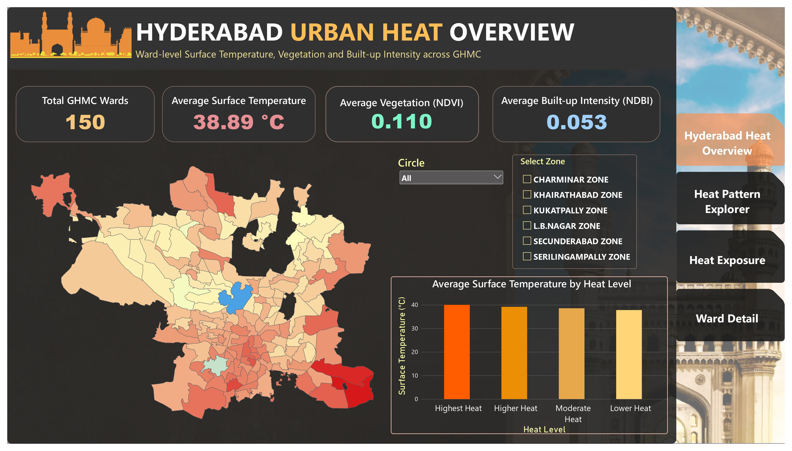
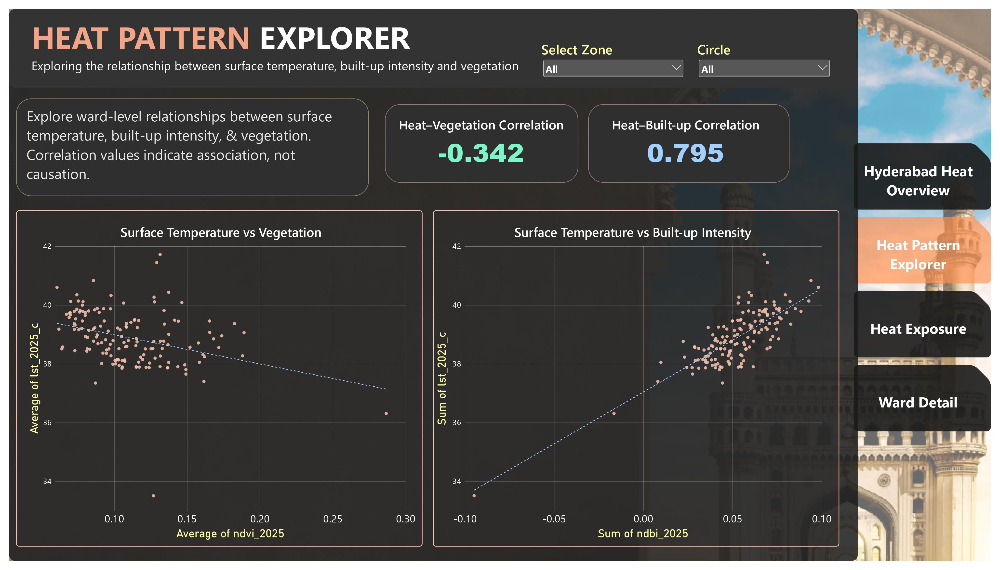
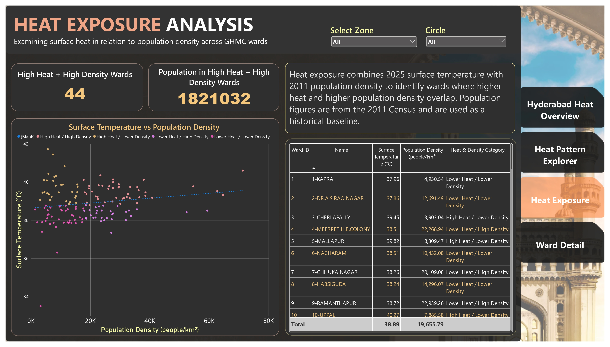
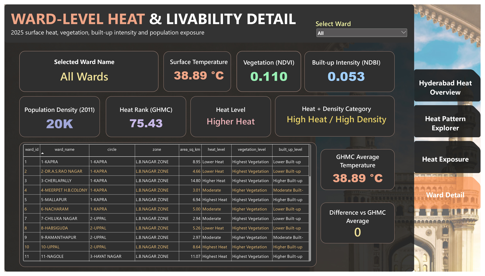

# Hyderabad Urban Heat & Livability Analytics

A ward-level geospatial analytics project examining surface heat, vegetation, built-up intensity, and population exposure across 150 GHMC wards in Hyderabad.

The project combines satellite-derived environmental indicators, GHMC ward boundaries, and Census population data to identify spatial patterns and areas where higher surface heat overlaps with higher population density.

## Project Overview

Urban heat is not distributed uniformly across a city. This project analyzes how surface temperature varies across Hyderabad's GHMC wards and examines its association with built-up intensity, vegetation, and population density.

The analysis is designed around an interactive Power BI workflow:

**Explore the map → filter an area → compare indicators → identify patterns → investigate individual wards**

The project focuses on **2025 environmental conditions**, with **2011 Census population data used as a historical population-density baseline**.

## Key Questions

* Which GHMC wards have the highest surface temperatures?
* Are wards with higher built-up intensity generally hotter?
* Is higher vegetation associated with lower surface temperature?
* Which wards combine higher surface heat with higher population density?
* How do heat patterns vary across GHMC zones and circles?
* How does an individual ward compare with the overall GHMC average?

## Dashboard Preview

### 1. Hyderabad Urban Heat Overview

Ward-level surface temperature distribution across GHMC, with interactive zone and circle filters.

### 2. Heat Pattern Explorer

Explores the relationship between surface temperature, built-up intensity, and vegetation across GHMC wards.

### 3. Heat Exposure Analysis

Examines the overlap between surface heat and population density to identify higher-heat, higher-density wards.

### 4. Ward-Level Heat & Livability Detail

Provides an individual ward-level view of temperature, vegetation, built-up intensity, population density, heat rank, and comparison with the GHMC average.

## Key Findings

### Surface Heat

* Average ward-level surface temperature: **38.89 °C**
* Highest observed ward-level median temperature: **41.72 °C**
* The hottest ward in the analysis was **HAYATHNAGAR (Ward 13)** at approximately **41.72 °C**.

### Heat and Built-up Intensity

Surface temperature and NDBI showed a strong positive association:

* Pearson correlation: **+0.795**
* Spearman correlation: **+0.731**

This indicates that wards with higher built-up intensity tended to have higher surface temperatures in the 2025 dataset.

### Heat and Vegetation

Surface temperature and NDVI showed a negative association:

* Pearson correlation: **−0.342**
* Spearman correlation: **−0.377**

This indicates that wards with higher vegetation index values tended to have lower surface temperatures in the analyzed dataset.

### Heat and Population Density

The relationship between surface temperature and 2011 population density was weaker:

* Pearson correlation: **+0.176**
* Spearman correlation: **+0.162**

Population density is used as a historical baseline because the available Census data is from 2011 rather than 2025.

### Heat Exposure

The analysis identified:

* **44 wards** classified as **High Heat / High Density**

These wards represent areas where higher surface heat overlaps with higher population density in the analytical framework.

## Power BI Dashboard

The dashboard contains four analytical pages.

### 1. Hyderabad Urban Heat Overview

Provides a map-first overview of ward-level surface temperature across GHMC.

Includes:

* Total GHMC wards
* Average surface temperature
* Average NDVI
* Average NDBI
* Interactive GHMC ward heat map
* Zone and circle filters
* Surface temperature by heat level

### 2. Heat Pattern Explorer

Examines relationships between surface temperature and environmental indicators.

Includes:

* Surface Temperature vs Built-up Intensity
* Surface Temperature vs Vegetation
* Interactive trend lines
* Heat–Built-up correlation
* Heat–Vegetation correlation

### 3. Heat Exposure Analysis

Examines heat in relation to population density.

Includes:

* Surface Temperature vs Population Density
* High Heat + High Density ward count
* Population associated with High Heat + High Density wards
* Ward-level exposure table
* Zone and circle filters

### 4. Ward-Level Heat & Livability Detail

Provides an individual ward-level view.

Users can select a ward and examine:

* Surface temperature
* Vegetation
* Built-up intensity
* Population density
* GHMC heat rank
* Heat level
* Heat + density category
* Difference from the GHMC average temperature
* Ward administrative information

## Data Sources

### GHMC Ward Boundaries

Ward boundary data was obtained from the **Telangana Geographic Information System (TGRAC)**.

The final spatial layer contains **150 numbered GHMC wards**.

The boundary geometries were validated and repaired where necessary before being used for spatial analysis and Power BI Shape Map visualization.

### Population Data

Population and household data were sourced from the **2011 Census of India Primary Census Abstract** datasets for Hyderabad and Rangareddy.

Population density was calculated as:

**Population Density = 2011 Population / Current GHMC Ward Area**

Because Census boundaries and current GHMC ward boundaries may not perfectly match, population density should be interpreted as an approximate historical baseline.

### Landsat

Land Surface Temperature was derived from **Landsat 8 and Landsat 9 Collection 2 Level-2** imagery acquired during March and April 2025.

Cloud and cloud-shadow pixels were excluded using Landsat quality-assurance information.

Multiple low-cloud scenes were processed and aggregated to obtain ward-level temperature statistics.

### Sentinel-2

Vegetation and built-up intensity were derived from **Sentinel-2 Level-2A** imagery acquired during March and April 2025.

Indicators:

* **NDVI** — vegetation index
* **NDBI** — built-up intensity indicator

NDBI represents spectral built-up intensity and should not be interpreted as a direct percentage of built-up land area.

## Methodology

The analytical workflow was:

1. Obtain GHMC ward boundaries.
2. Clean and validate ward geometries.
3. Integrate 2011 Census population and household data.
4. Acquire low-cloud Landsat scenes for 2025.
5. Derive land surface temperature.
6. Acquire low-cloud Sentinel-2 scenes.
7. Calculate NDVI and NDBI.
8. Aggregate satellite indicators to ward level.
9. Calculate population density and percentile-based indicators.
10. Create heat, vegetation, built-up, and heat-density categories.
11. Validate the final 150-ward analytical dataset.
12. Load the final dataset into MySQL.
13. Perform SQL-based analysis.
14. Build an interactive Power BI dashboard.

## Technical Stack

**Data Collection & Processing**

* Python
* Pandas
* GeoPandas
* Rasterio
* Shapely
* Planetary Computer STAC

**Database & Analysis**

* MySQL
* SQL
* Statistical correlation analysis

**Visualization**

* Microsoft Power BI
* Power BI Shape Map
* DAX

**Geospatial Analysis**

* GHMC ward polygons
* Landsat
* Sentinel-2
* Ward-level spatial aggregation

## Data Quality Checks

The final analytical dataset contains:

* **150 rows**
* **150 unique wards**
* **0 duplicate wards**
* **0 missing LST values**
* **0 missing NDVI values**
* **0 missing NDBI values**
* **2 wards without population-density values**

The two population-density gaps correspond to wards where the required Census population information was not available in the sourced records.

## Important Limitations

### Surface Temperature vs Air Temperature

The temperature variable represents **land surface temperature (LST)** derived from satellite imagery. It is not the same as directly measured near-surface air temperature.

### Population Baseline

Population information comes from the **2011 Census**, while environmental indicators represent **2025 conditions**. Therefore, population exposure results should not be interpreted as 2025 population estimates.

### Boundary Alignment

Historical Census units and current GHMC ward boundaries may not perfectly align. Population density is therefore an approximate baseline calculated using current ward areas.

### Association vs Causation

Correlation results describe statistical association and do not establish causation.

For example, the positive relationship between NDBI and LST indicates that higher built-up intensity and higher surface temperature tend to occur together in this dataset, but it does not by itself prove that built-up intensity causes higher temperature.

## Skills Demonstrated

* Data cleaning and validation
* Geospatial data processing
* Remote sensing analysis
* Satellite-derived environmental indicators
* Python data analysis
* SQL analysis
* MySQL
* Statistical correlation analysis
* DAX
* Power BI dashboard development
* Interactive data visualization
* Spatial pattern analysis
* Data quality assessment
* Analytical storytelling

## Project Outcome

The final project provides an interactive ward-level analytical view of Hyderabad's 2025 surface heat patterns and their relationship with vegetation, built-up intensity, and population density.

Rather than treating heat as a single city-wide value, the dashboard enables users to explore spatial variation across GHMC wards and investigate areas where multiple indicators overlap.
